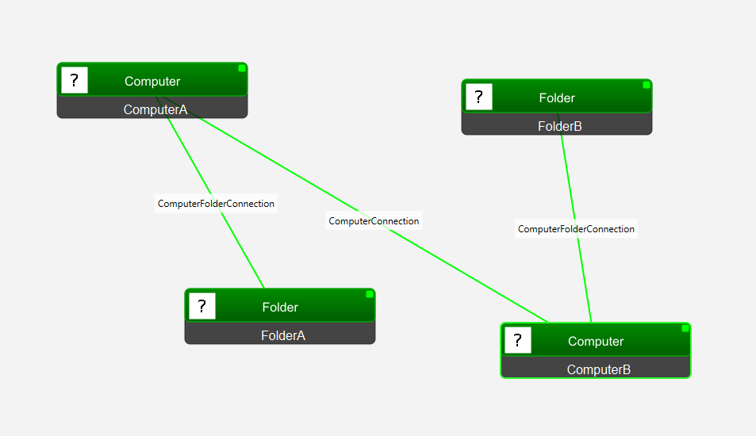

# Tutorial 3 - How to use the MAL GUI
The mal-gui is a graphical user interface tool used to create MAL instance models and scenarios (specifying attack agents). In this tutorial we will learn how to use it.

## Installation
1. In your working directory, clone the mal-gui repository: `git clone https://github.com/mal-lang/mal-gui.git`.
2. Create a virtual environment and activate it.
    - On Linux-based operating systems:
    ```
    python -m venv venv
    source venv/bin/activate
    ```
    - On Windows:
    ```
    python -m venv venv
    .\venv\Scripts\activate
    ```
3. Install the mal-gui package: `pip install mal-gui`. This will automatically install `mal-toolbox` and `mal-simulator`.
4. Run the GUI: `malgui`

## Loading a language and creating the model
When we first run the GUI, we get the following Window:


If you don't know how to create a MAL language, you can follow this [tutorial](https://github.com/mal-lang/mal-toolbox-tutorial/tree/main/tutorials/language-model-tutorial).

For the sake of completeness, we will download and use the same simple MAL language used in that tutorial (`my-language.mal`). We will build the same model as well.

The next step is to **add assets**. To do so, we can drag and drop new assets from the object explorer on the left. In this case, they are `Computer` and `Folder`. You can change the name of the assets by double-clicking on each of the individual boxes.

Then, we can **create associations** between assets. To do so, press SHIFT while you click on one of the assets, drag to the other asset, and let go. A window will pop up to choose the association type.



## Define a scenario
To define a scenario, we set an entry point for the attacker. We will choose the entry point used in the [tutorial](https://github.com/mal-lang/mal-toolbox-tutorial/tree/main/tutorials/language-model-tutorial) we have been using. To do so, drag and drop the `Attacker` asset from the left menu and create an association with `ComputerA` and choose `access`.

