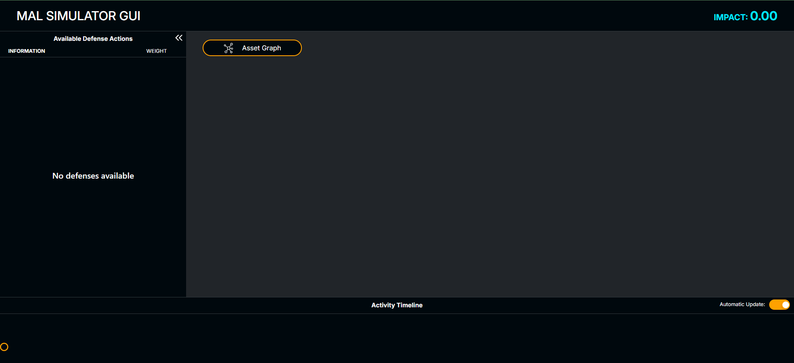

# Tutorial 4 - How to use the MAL Sim GUI

In this tutorial we learn how to use the dedicated Graphifal User Interface for the MAL Sim tool. Before starting this tutorial, it is advisable to complete tutorials [1](https://github.com/mal-lang/mal-toolbox-tutorial/blob/main/tutorials/tutorial1/language-model-tutorial.md) and [2](https://github.com/mal-lang/mal-toolbox-tutorial/blob/main/tutorials/tutorial2/model-tutorial.md) on working with MAL languages, models, and simulations.

## Running MAL-Sim-GUI

The most user-friendly way to run the GUI is via Docker. If you would like to run it without using Docker, you might find more information about this How-To, next to more information about this GUI-tool, in the MAL-Sim-GUI dedicated repository: [Link to Repo](https://github.com/mal-lang/malsim-gui)

To proceed with Docker:

- Install docker on your system. You will find more info at the [Docker Website](https://www.docker.com/)
- Open your terminal and run `docker run -p 8888:8888 mrkickling/malsim-gui:0.0.0`. This will automate the downloading of the docker and its launching
- Once the Docker is running, you might access the GUI via your browser by opening (http://localhost:8888). At this point, you should be able to see the main view of the GUI:

