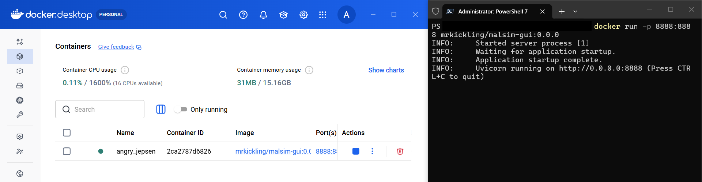
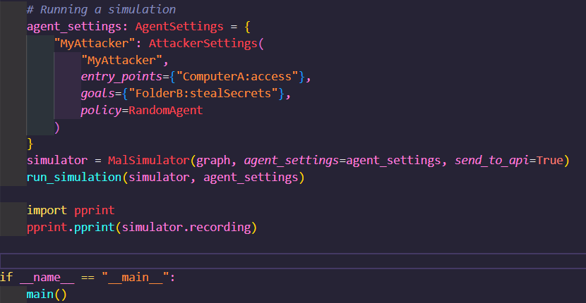

# Tutorial 5 - How to use the MALSIM GUI

In this tutorial we learn how to use the dedicated Graphical User Interface for the MALSIM tool, or malsim-gui. Before starting this tutorial, it is advisable to complete tutorials [1](https://github.com/mal-lang/mal-toolbox-tutorial/blob/main/tutorials/tutorial1/language-model-tutorial.md) and [2](https://github.com/mal-lang/mal-toolbox-tutorial/blob/main/tutorials/tutorial2/model-tutorial.md) on working with MAL languages, models, and simulations.

## Starting MALSIM GUI

The most user-friendly way to run the GUI is via Docker. If you would like to run it without using Docker, you might find more information about this How-To, next to more information about this tool, in the malsim-gui dedicated repository: [Link to Repo](https://github.com/mal-lang/malsim-gui)

To proceed with Docker:

- Download and install docker on your system. You will find more info at the [Docker Website](https://www.docker.com/).
- Launch your Docker platform on your machine, open your terminal and run `docker run -p 8888:8888 mrkickling/malsim-gui:0.0.0`. This will automate the downloading of the docker and its launching.

- Once the Docker image is running, you might access the GUI via your browser by opening (http://localhost:8888). At this point, you should be able to see the main view of the GUI:

## Running a Simulation

To run a simulation, we might just follow the steps described in [Tutorial #1](tutorials/tutorial1/language-model-tutorial.md). However, in order to see the simulation-related information on the browser you must do one of the following:
- If you run simulations via script, you will need to pass `send_to_api=True` as an argument when instatiating the MalSimulator() object.

- As an alternative, if you run the simulations from the command line, you will need to use the -g flag.

Regardless of the method chosen to run the simulation, you will need to reaload the browser once you have run the simulation. Then, the data related to the simulation should be visible in the browser. 

